<!--
	AI Podcast Clips — Comprehensive README
	This README explains the product, architecture, setup, and workflow end-to-end.
-->

# AI Podcast Clips

Turn full podcast episodes into viral, short-form clips tailored for YouTube Shorts, TikTok, and Reels. The system transcribes audio, finds high-impact moments, centers the active speaker, adds subtitles, and exports vertical clips ready to download.

Live app: https://frontend-five-snowy-51.vercel.app/


## 📸 Product Preview

Below are the screenshots from my deployed app to the `docs/images` folder

- `hero.png` — Landing hero section
- `features.png` — Features grid
- `pricing.png` — Pricing plans
- `dashboard-upload.png` — Upload & processing queue
- `dashboard-clips.png` — Generated clips preview

| Landing | Features | Pricing |
|---|---|---|
| 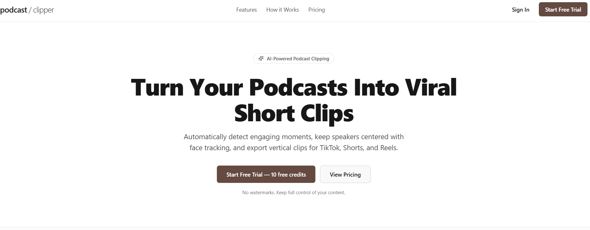 | 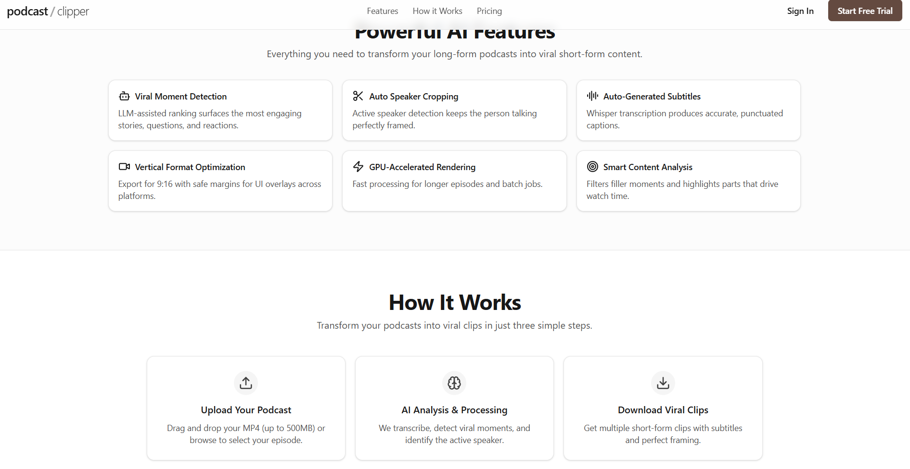 | 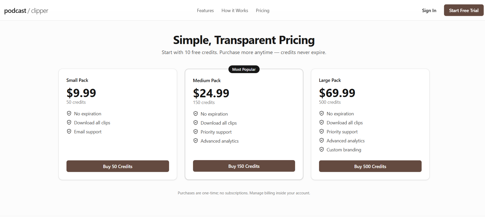 |

| Upload & Queue | Generated Clips |
|---|---|
| 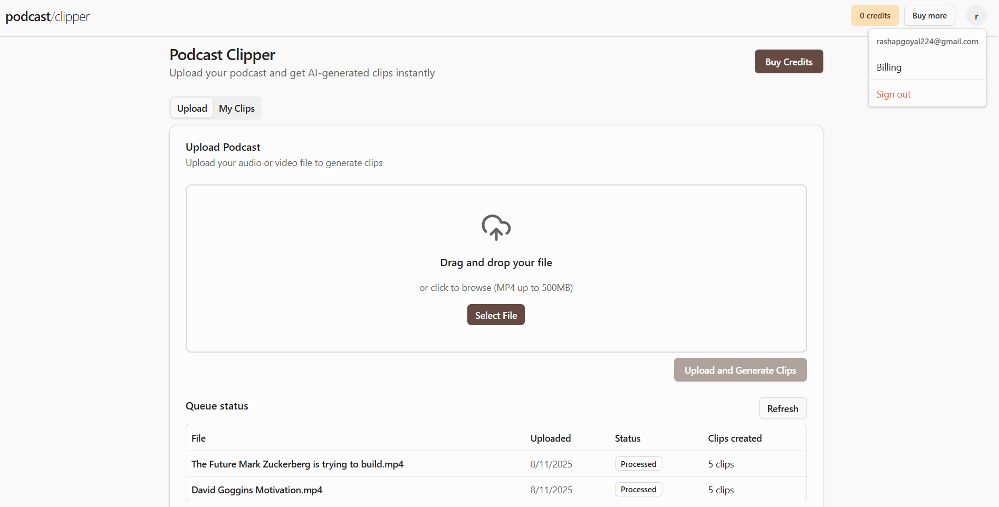 | 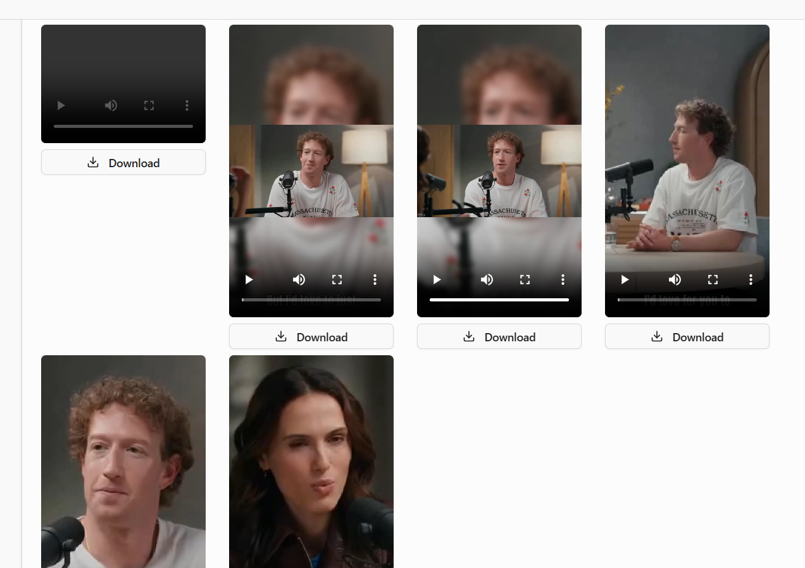 |


## 🚀 What It Does

- Detects viral moments (questions, stories, engaging answers)
- Transcribes speech with WhisperX and aligns to word timing
- Tracks the active speaker’s face with LR‑ASD and keeps them centered
- Renders 9:16 vertical video with blurred background and sharp crop
- Generates large, legible subtitles automatically
- Stores assets in S3 and serves secure, expiring playback links
- Runs heavy compute on GPUs via Modal; orchestrated from the Next.js app
- Processes work in the background via Inngest; credits deducted per clip
- Users purchase credits via Stripe checkout


## 🧩 Tech Stack

### Frontend
- Next.js 15, React, TypeScript
- Tailwind CSS + shadcn/ui
- Auth.js (email/password) + Prisma Adapter
- Inngest (job orchestration)

### Backend (GPU pipeline)
- FastAPI running inside Modal serverless GPUs
- WhisperX (transcription + alignment)
- Google Gemini (moment selection)
- LR‑ASD (active speaker detection)
- ffmpeg/ffmpegcv (rendering, filters, muxing)
- AWS S3 (input + output clips)

### Data & Billing
- PostgreSQL + Prisma
- Stripe Checkout + Webhooks (credits-based)


## 🗺️ Architecture Overview

### High-level creating clips flow

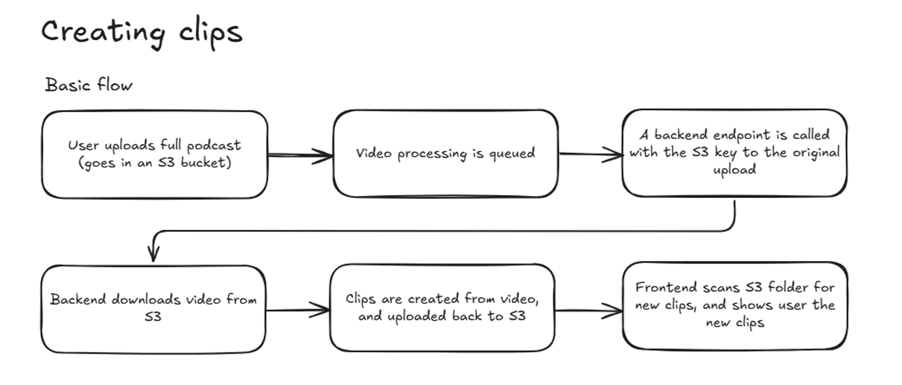

### Queue system (Inngest orchestration)

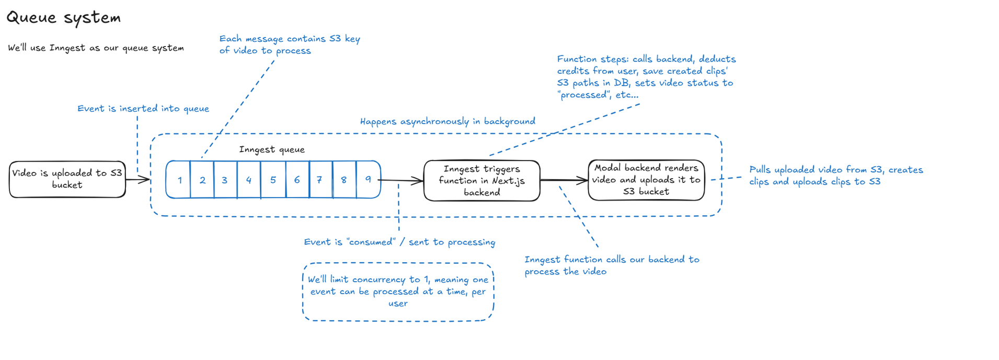

Key queues and APIs:
- Inngest event: `process-video-events`
- Modal endpoint: `POST /process_video` (secured via bearer token)


## 🧠 Processing Pipeline (Backend)
Visual overview of steps the backend performs:

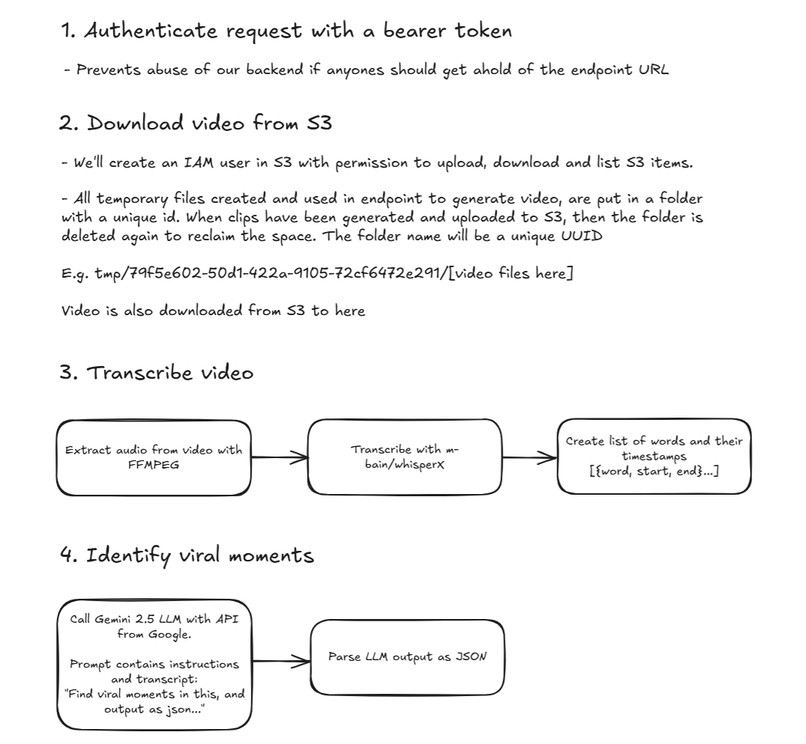

Detailed create-clips flow executed per selected moment:

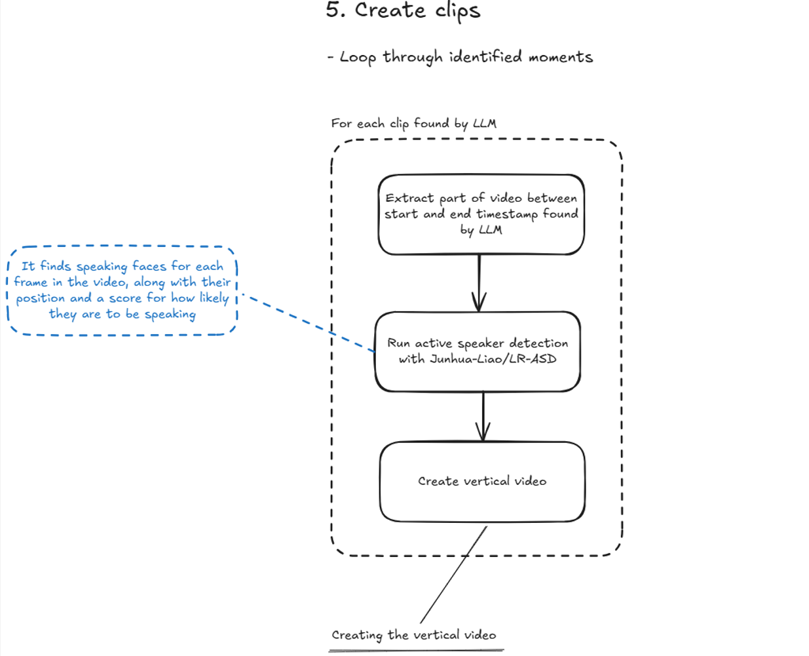

Vertical video framing strategy (crop/blur + active speaker centering):

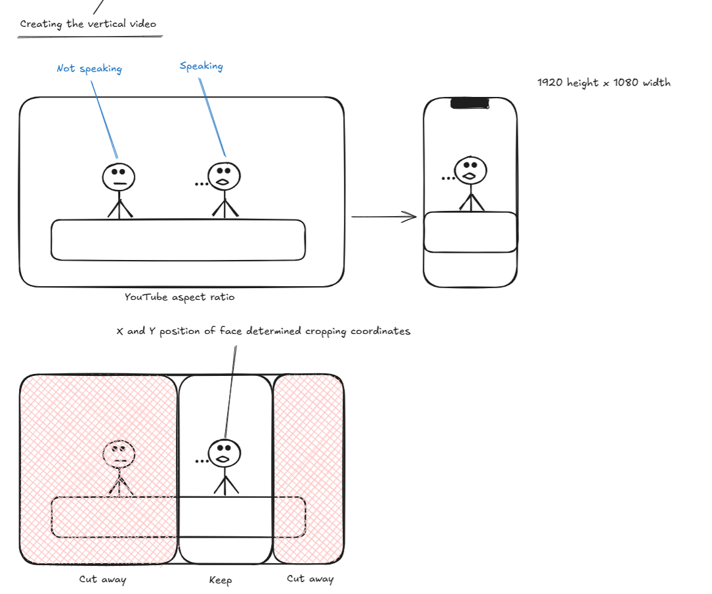

Controls and knobs:
- `GEMINI_MODEL` to pick model (e.g., `gemini-2.5-pro` or `gemini-2.5-flash`).
- `MAX_CLIPS` env or request `max_clips` controls how many clips to render.
- Sentence gap and word caps are tuned in `main.py`.


## 📦 Project Structure

```
ai-podcast-clips/
├── backend/               # Modal FastAPI app + ML/video pipeline
│   ├── main.py            # Core pipeline & /process_video endpoint
│   ├── requirements.txt   # Python deps for Modal image
│   └── LR-ASD/            # Active speaker detector (vendored)
├── frontend/              # Next.js + Prisma + Inngest + Stripe
│   ├── src/
│   │   ├── actions/       # S3 uploads, Stripe, job kickoff
│   │   ├── app/           # Routes & API (incl. Inngest, webhooks)
│   │   ├── inngest/       # Client & function (process-video)
│   │   └── server/        # Prisma, Auth.js
│   └── prisma/            # Schema & migrations
├── docs/
│   └── images/            # Screenshots used in README
└── README.md
```


## 🔐 Environment Variables

Set the following environment variables. Values shown are placeholders.

### Frontend (`frontend/.env.local`)

```
# Auth.js
AUTH_SECRET="<strong-random-secret>"

# Database
DATABASE_URL="postgres://<user>:<pass>@<host>/<db>?sslmode=require"

# AWS (must match your S3 bucket region + name)
AWS_REGION="<aws-region>"
AWS_ACCESS_KEY_ID="<aws-access-key-id>"
AWS_SECRET_ACCESS_KEY="<aws-secret-access-key>"
S3_BUCKET_NAME="<bucket-name>"  # Same bucket used by backend

# Backend processing endpoint (Modal FastAPI)
PROCESS_VIDEO_ENDPOINT="<modal-fastapi-url>/process_video"
PROCESS_VIDEO_ENDPOINT_AUTH="<bearer-token>" # Must match backend AUTH_TOKEN

# Stripe
NEXT_PUBLIC_STRIPE_PUBLISHABLE_KEY="<pk_live_or_test>"
STRIPE_SECRET_KEY="<sk_live_or_test>"
STRIPE_SMALL_CREDIT_PACK="<price_id_small>"
STRIPE_MEDIUM_CREDIT_PACK="<price_id_medium>"
STRIPE_LARGE_CREDIT_PACK="<price_id_large>"
STRIPE_WEBHOOK_SECRET="<whsec_...>"
BASE_URL="http://localhost:3000" # or your deployed domain
```

### Backend (Modal Secret: `ai-podcast-clips-secret`)

Store these in a Modal Secret for the app (used inside the GPU container):

```
AWS_ACCESS_KEY_ID=<aws-access-key-id>
AWS_SECRET_ACCESS_KEY=<aws-secret-access-key>
AWS_REGION=<aws-region>
GEMINI_API_KEY=<google-ai-studio-key>  # or GOOGLE_API_KEY
GEMINI_MODEL=gemini-2.5-flash          # optional override
AUTH_TOKEN=<same-token-as-frontend>
MAX_CLIPS=6                            # optional soft cap
```

Note: The backend currently uploads to an S3 bucket named `clips-podcast`. Create this bucket (or change the bucket name in `backend/main.py`).


## 🧪 Local Development (Windows PowerShell)

Prereqs:
- Python 3.12+
- Node.js 18+
- PostgreSQL 14+
- AWS account + S3 bucket

Clone and install:

```powershell
git clone https://github.com/rashap224/ai-podcast-clips.git
cd ai-podcast-clips
```

### 1) Backend on Modal

```powershell
cd backend
pip install -r requirements.txt

# First-time Modal setup (interactive)
modal setup

# Local test run (invokes the fastapi endpoint from a local entrypoint)
modal run main.py

# Deploy backend API to Modal
modal deploy main.py
```

After deploy, grab the deployed FastAPI endpoint URL for `PROCESS_VIDEO_ENDPOINT`.

### 2) Frontend (Next.js)

```powershell
cd frontend
npm install
npx prisma generate

# DB migrations (adjust if you manage migrations separately)
npx prisma migrate deploy

npm run dev
```

Local URLs:
- Frontend: http://localhost:3000


## 🧭 How Users Navigate the App

1) Sign up / sign in → land on dashboard
2) Upload an MP4 (drag & drop). File goes to S3 via presigned URL
3) Click “Upload and Generate Clips” → event queued in Inngest
4) Inngest calls Modal FastAPI → pipeline runs on GPU and writes clips to S3
5) Dashboard shows queue status and lists generated clips
6) Click “Download” to save mp4s; buy more credits via Stripe if needed

See screenshots above for each step.


## 🔌 Key APIs & Contracts

### Frontend → Backend (Modal)

POST `{PROCESS_VIDEO_ENDPOINT}`

Headers:
- `Authorization: Bearer <PROCESS_VIDEO_ENDPOINT_AUTH>`
- `Content-Type: application/json`

Body:
```
{ "s3_key": "<uuid>/original.mp4" }
```

Response:
- 200 OK on accept; processing is asynchronous. Clips are written back to S3 under `<uuid>/clip_N.mp4`.

### S3 Keys
- Uploads: `<uuid>/original.mp4`
- Outputs: `<uuid>/clip_0.mp4`, `<uuid>/clip_1.mp4`, ...

### Inngest function execution steps

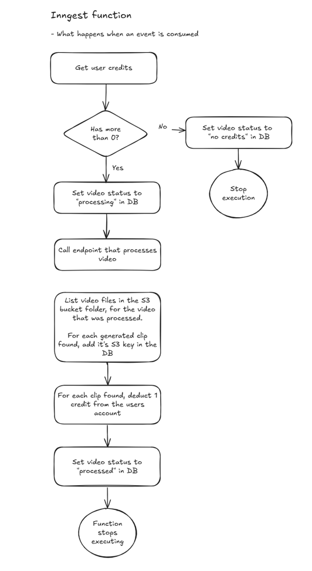


## 🧱 Database Models (Prisma)

- User (credits, stripeCustomerId)
- UploadedFile (s3Key, status, uploaded)
- Clip (s3Key, belongs to user + uploaded file)
- Account/Session/VerificationToken (Auth.js)


## 🛠️ Development Workflow

- Branching: feature branches → PR to `main`
- Code style: Prettier + ESLint (see `frontend` config)
- Types: strict TypeScript in `frontend`
- Database: update `prisma/schema.prisma`, then `npx prisma migrate dev`
- Background jobs: add new Inngest functions in `src/inngest/functions.ts`
- GPU pipeline: edit `backend/main.py`; redeploy via `modal deploy main.py`


## 🧯 Troubleshooting

- Clips don’t appear: ensure the Inngest function ran and the `clips-podcast` bucket contains new objects under the same UUID folder; check credits weren’t zero.
- `401 Unauthorized` from backend: make sure `PROCESS_VIDEO_ENDPOINT_AUTH` equals backend `AUTH_TOKEN`.
- Stripe webhooks: set `STRIPE_WEBHOOK_SECRET` and run Stripe CLI in dev; check that credits increment on `checkout.session.completed`.
- Modal failures: open Modal logs for the app; verify the secret `ai-podcast-clips-secret` contains AWS + GEMINI keys.
- Subtitles font missing: the Modal image downloads Anton font at build time; redeploy if needed.


## 🗺️ Roadmap

- Multilingual subtitles
- More “clip styles” (Q&A, story, teachable moment)
- YouTube URL ingestion (yt-dlp) and channel sync
- Scheduled auto-posting
- Low-res preview → selective re-render in HD


## 🙌 Credits

- [LR‑ASD](https://github.com/Junhua-Liao/LR-ASD)
- [WhisperX](https://github.com/m-bain/whisperX)
- [Modal](https://modal.com)
- [Inngest](https://www.inngest.com/)
- [Auth.js](https://authjs.dev)
- [Stripe](https://stripe.com)
- [Tailwind CSS](https://tailwindcss.com)
- [Prisma](https://www.prisma.io)
- [PostgreSQL](https://www.postgresql.org)


